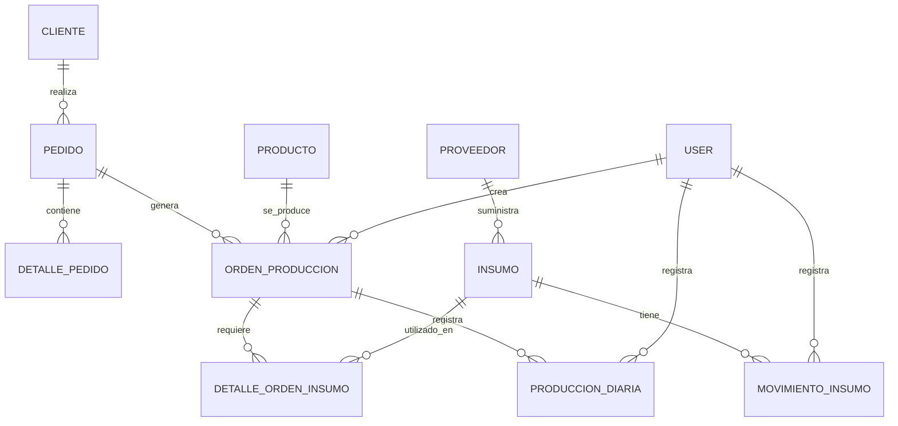
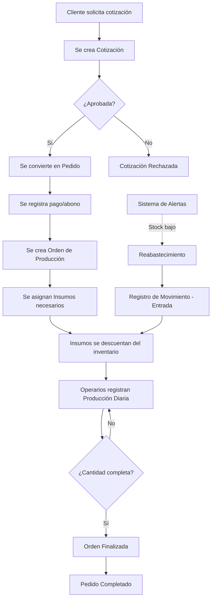
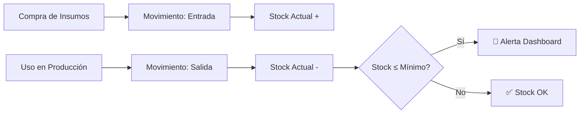

# 🧵 Análisis Completo del Sistema de Gestión para Pedidos en Manufacturas R.J. Atlántico C.A

## 📋 Resumen Ejecutivo

Este es un **Sistema de Gestión para Pedidos** desarrollado con **Laravel 10** para automatizar y optimizar los procesos de la empresa textil Manufacturas R.J. Atlántico C.A. El sistema implementa una arquitectura **MVC (Modelo-Vista-Controlador)** y utiliza MySQL como base de datos.

---

## 🏗️ Arquitectura del Sistema

### Stack Tecnológico

#### Backend
- **Framework**: Laravel 10 (PHP 8.1+)
- **Base de Datos**: MySQL
- **Autenticación**: Laravel Breeze + Sanctum
- **Generación de PDFs**: DomPDF
- **DataTables**: Yajra Laravel DataTables

#### Frontend
- **Template**: Velzon Admin Template v4.3.0 (Themesbrand)
- **Motor de Plantillas**: Blade
- **CSS Framework**: Tailwind CSS
- **Build Tool**: Vite
- **JavaScript**: Vanilla JS + librerías integradas (ApexCharts, Chart.js)

#### Desarrollo
- **Testing**: PHPUnit
- **Gestor de Dependencias**: Composer (PHP), npm (JS)

---

## 📊 Estructura de la Base de Datos

### Modelos Principales

El sistema cuenta con **14 modelos** que representan las entidades del negocio:

1. **User** - Usuarios del sistema
2. **Cliente** - Clientes de la empresa
3. **Producto** - Productos textiles que se fabrican
4. **Insumo** - Materias primas y suministros
5. **Proveedor** - Proveedores de insumos
6. **Pedido** - Pedidos de clientes
7. **DetallePedido** - Detalles de productos en cada pedido
8. **Cotizacion** - Cotizaciones para clientes
9. **DetalleCotizacion** - Detalles de cada cotización
10. **OrdenProduccion** - Órdenes de producción
11. **DetalleOrdenInsumo** - Insumos asignados a órdenes de producción
12. **ProduccionDiaria** - Registro diario de producción
13. **MovimientoInsumo** - Movimientos de inventario (entradas/salidas)
14. **Banco** - Bancos para pagos

### Relaciones Clave



---

## 👥 Sistema de Roles y Permisos

El sistema implementa **4 roles principales**:

### 1. **Administrador**
- Acceso completo al sistema
- Gestión de usuarios
- Configuración del sistema
- Visualización de todos los reportes

### 2. **Supervisor**
- Supervisión de producción
- Creación y gestión de órdenes de producción
- Acceso a reportes de eficiencia
- Gestión de pedidos

### 3. **Operario**
- Registro de producción diaria
- Consulta de órdenes asignadas
- Registro de avances de producción

### 4. **Almacenero**
- Gestión de inventario de insumos
- Registro de entradas y salidas
- Control de existencias
- Alertas de stock mínimo

---

## ⚙️ Módulos Funcionales

### 1️⃣ **Gestión de Clientes**
**Controlador**: `ClienteController.php`

**Funcionalidades**:
- ✅ CRUD completo de clientes
- ✅ Búsqueda AJAX de clientes
- ✅ Exportación de reporte PDF de clientes
- ✅ DataTables para visualización

**Campos principales**:
- Nombre, email, teléfono, CI/RIF, dirección
- Soft deletes (eliminación lógica)

---

### 2️⃣ **Gestión de Productos**
**Controlador**: `ProductoController.php`

**Funcionalidades**:
- ✅ Catálogo de productos textiles
- ✅ Control de precios
- ✅ Generación de reportes PDF
- ✅ Gestión de características (tallas, colores)

---

### 3️⃣ **Gestión de Proveedores**
**Controlador**: `ProveedorController.php`

**Funcionalidades**:
- ✅ Registro de proveedores
- ✅ Información de contacto
- ✅ Historial de suministros
- ✅ DataTables integrado

---

### 4️⃣ **Gestión de Pedidos** ⭐
**Controlador**: `PedidoController.php` (18,414 bytes - módulo más extenso)

**Funcionalidades principales**:
- ✅ Creación de pedidos con múltiples productos
- ✅ Gestión de detalles (cantidad, talla, color, descripción, logo)
- ✅ Control de estados: Pendiente, En Proceso, Completado, Cancelado
- ✅ Gestión de pagos:
  - Efectivo
  - Transferencia bancaria
  - Pago móvil
  - Control de abonos y referencias
- ✅ Generación de PDF individual por pedido
- ✅ Reporte general de pedidos en PDF
- ✅ Fechas de entrega estimada
- ✅ Priorización de pedidos

**Modelo de datos**:
```php
- cliente_nombre, cliente_email, cliente_telefono
- ci_rif
- fecha_pedido, fecha_entrega_estimada
- estado, total, prioridad
- abono, efectivo_pagado, transferencia_pagado, pago_movil_pagado
- referencia_transferencia, referencia_pago_movil
- banco_id, user_id
```

---

### 5️⃣ **Gestión de Cotizaciones**
**Controlador**: `CotizacionController.php` (10,918 bytes)

**Funcionalidades**:
- ✅ Creación de cotizaciones para clientes
- ✅ Conversión de cotizaciones a pedidos
- ✅ Detalles de productos y precios
- ✅ Generación de PDF de cotización
- ✅ Reporte general de cotizaciones
- ✅ Estados: Pendiente, Aprobada, Rechazada

---

### 6️⃣ **Gestión de Insumos e Inventario** 📦
**Controladores**: `InsumoController.php`, `MovimientoInsumoController.php`

#### Módulo de Insumos
**Funcionalidades**:
- ✅ Catálogo de insumos (telas, hilos, botones, etc.)
- ✅ Tipos de insumos
- ✅ Unidades de medida
- ✅ Costo unitario
- ✅ Stock actual y stock mínimo
- ✅ Asociación con proveedores

**Campos del modelo**:
```php
- nombre, tipo, unidad_medida
- costo_unitario
- stock_actual, stock_minimo
- proveedor_id, estado
```

#### Módulo de Movimientos de Inventario
**Funcionalidades**:
- ✅ Registro de entradas de insumos
- ✅ Registro de salidas de insumos
- ✅ Historial completo de movimientos
- ✅ Reporte de existencias
- ✅ **Alertas de stock bajo** (cuando stock_actual ≤ stock_minimo)
- ✅ Trazabilidad completa (quién registró, cuándo)

**Tipos de movimientos**:
- Entrada
- Salida
- Ajuste

---

### 7️⃣ **Órdenes de Producción** 🏭
**Controlador**: `OrdenProduccionController.php` (7,233 bytes)

**Funcionalidades**:
- ✅ Creación de órdenes desde pedidos
- ✅ Asignación de productos a fabricar
- ✅ Cantidad solicitada vs cantidad producida
- ✅ Control de estados:
  - Pendiente
  - En Proceso
  - Finalizado
  - Cancelado
- ✅ Fechas de inicio y fin estimadas
- ✅ Costo estimado
- ✅ Gestión de logos personalizados
- ✅ Notas adicionales
- ✅ Trazabilidad (created_by)

**Modelo de datos**:
```php
- pedido_id, producto_id
- cantidad_solicitada, cantidad_producida
- fecha_inicio, fecha_fin_estimada
- estado, costo_estimado
- logo, notas, created_by
```

---

### 8️⃣ **Control de Insumos por Orden**
**Controlador**: `DetalleOrdenInsumoController.php`

**Funcionalidades**:
- ✅ Asignación de insumos a órdenes de producción
- ✅ Cantidad estimada de insumos necesarios
- ✅ Registro de cantidad utilizada real
- ✅ Comparación estimado vs. real
- ✅ Control de consumo de materias primas

**Tabla pivot**: `detalle_orden_insumos`
```php
- orden_produccion_id
- insumo_id
- cantidad_estimada
- cantidad_utilizada
```

---

### 9️⃣ **Producción Diaria** 📈
**Controlador**: `ProduccionDiariaController.php` (6,323 bytes)

**Funcionalidades**:
- ✅ Registro diario de producción por operario
- ✅ Vinculación con órdenes de producción
- ✅ Cantidad producida por día
- ✅ Control de calidad textil
- ✅ Observaciones y notas
- ✅ Seguimiento de eficiencia

**Modelo de datos**:
```php
- orden_produccion_id
- operario_id (User)
- fecha_produccion
- cantidad_producida
- observaciones
```

---

### 🔟 **Sistema de Reportes** 📊
**Controlador**: `ReportesController.php`

**Reportes disponibles**:

1. **Reporte de Producción**
   - Total producido por período
   - Producción por producto
   - Tendencias de producción

2. **Reporte de Eficiencia**
   - Eficiencia por operario
   - Cumplimiento de órdenes
   - Tiempos de producción

3. **Reporte de Insumos**
   - Consumo de insumos
   - Inventario actual
   - Proyecciones de reabastecimiento

4. **Reporte de Operarios**
   - Rendimiento individual
   - Producción por operario
   - Comparativas

---

## 🎛️ Dashboard Principal

**Controlador**: `HomeController.php`

### Indicadores Clave (KPIs)
El dashboard muestra:

1. **Total de Insumos** - Cantidad de insumos registrados
2. **Órdenes en Proceso** - Órdenes con estado "En Proceso"
3. **Producción Total** - Suma de toda la producción registrada
4. **Alertas de Stock** - Insumos con stock_actual ≤ stock_minimo

### Gráficos Interactivos

1. **Inventario de Insumos**
   - Visualización del stock actual de cada insumo
   - Indicadores visuales de stock bajo

2. **Órdenes por Estado**
   - Distribución de órdenes:
     - Pendientes
     - En Proceso
     - Finalizadas
     - Canceladas

3. **Últimos Movimientos de Inventario**
   - 5 movimientos más recientes
   - Tipo y cantidad de movimiento

---

## 🔐 Autenticación y Seguridad

### Sistema de Autenticación
- **Laravel Breeze**: Sistema de autenticación completo
- **Middleware**: Protección de rutas con `auth` middleware
- **Sesiones**: Gestión de sesiones de usuario

### Permisos basados en roles
```php
// Métodos del modelo User
- isAdmin()
- isSupervisor()
- isOperario()
- isAlmacenero()
- hasRole($roles) // Verificar múltiples roles
```

---

## 🌐 Rutas del Sistema

### Rutas Públicas (Sin autenticación)
```php
/ - Página de inicio
/about - Acerca de
/contact - Contacto
/faq - Preguntas frecuentes
/portfolio - Portafolio
```

### Rutas Protegidas (Requieren autenticación)

#### Core
- `/dashboard` - Panel principal

#### Gestión
- `/users` - Usuarios (Resource routes)
- `/clientes` - Clientes (Resource + búsqueda AJAX + PDF)
- `/productos` - Productos (Resource + PDF)
- `/proveedores` - Proveedores (Resource)

#### Operaciones
- `/pedidos` - Pedidos (Resource + reportes + PDF individual)
- `/cotizaciones` - Cotizaciones (Resource + reportes + PDF)
- `/insumos` - Insumos (Resource)

#### Producción
- `/ordenes` - Órdenes de producción (Resource)
- `/ordenes/{orden}/insumos` - Gestión de insumos por orden
- `/produccion/diaria` - Producción diaria

#### Inventario
- `/existencia/movimientos` - Movimientos de inventario
- `/existencia/reporte` - Reporte de existencias
- `/existencia/alertas` - Alertas de stock
- `/existencia/movimientos/historial/{id}` - Historial por insumo

#### Reportes
- `/reportes/produccion` - Reporte de producción
- `/reportes/eficiencia` - Reporte de eficiencia
- `/reportes/insumos` - Reporte de insumos
- `/reportes/operarios` - Reporte de operarios

---

## 📁 Estructura de Archivos Clave

```
Sistema_Atlantico_Definitivo/
├── app/
│   ├── Http/
│   │   ├── Controllers/
│   │   │   ├── Auth/ (9 archivos)
│   │   │   ├── ClienteController.php
│   │   │   ├── CotizacionController.php
│   │   │   ├── DetalleOrdenInsumoController.php
│   │   │   ├── HomeController.php
│   │   │   ├── InsumoController.php
│   │   │   ├── MovimientoInsumoController.php
│   │   │   ├── OrdenProduccionController.php
│   │   │   ├── PagesController.php
│   │   │   ├── PedidoController.php ⭐
│   │   │   ├── ProduccionDiariaController.php
│   │   │   ├── ProductoController.php
│   │   │   ├── ProveedorController.php
│   │   │   ├── ReportesController.php
│   │   │   └── UserController.php
│   │   ├── Middleware/ (10 archivos)
│   │   └── Requests/ (2 archivos)
│   ├── Models/
│   │   ├── Banco.php
│   │   ├── Cliente.php
│   │   ├── Cotizacion.php
│   │   ├── DetalleCotizacion.php
│   │   ├── DetalleOrdenInsumo.php
│   │   ├── DetallePedido.php
│   │   ├── Insumo.php
│   │   ├── MovimientoInsumo.php
│   │   ├── OrdenProduccion.php
│   │   ├── Pedido.php
│   │   ├── ProduccionDiaria.php
│   │   ├── Producto.php
│   │   ├── Proveedor.php
│   │   └── User.php
│   └── ...
├── database/
│   ├── migrations/ (27 migraciones)
│   └── seeders/ (9 seeders)
├── resources/
│   ├── views/ (88 vistas Blade)
│   ├── css/
│   └── js/
├── routes/
│   ├── web.php ⭐ (114 líneas - rutas principales)
│   ├── api.php
│   └── auth.php
├── public/
│   └── (2,898 archivos - assets del template Velzon)
├── .env (Configuración de entorno)
├── composer.json
└── package.json
```

---

## 🔧 Configuración del Sistema

### Variables de Entorno (.env)

#### Aplicación
```env
APP_NAME=Laravel
APP_ENV=local
APP_DEBUG=true
APP_URL=http://localhost
```

#### Base de Datos
```env
DB_CONNECTION=mysql
DB_HOST=127.0.0.1
DB_PORT=3306
DB_DATABASE=atlantico_db_exp
DB_USERNAME=root
DB_PASSWORD=mysql
```

#### Email (Mailtrap)
```env
MAIL_MAILER=smtp
MAIL_HOST=sandbox.smtp.mailtrap.io
MAIL_PORT=2525
MAIL_FROM_ADDRESS="notificaciones@financiera.com"
```

---

## 🎯 Flujo de Trabajo del Sistema

### Proceso Completo de Pedido a Producción



### Gestión de Inventario



---

## 📊 Características Destacadas

### ✨ Funcionalidades Avanzadas

1. **DataTables Dinámicas**
   - Paginación del lado del servidor
   - Búsqueda en tiempo real
   - Ordenamiento de columnas
   - Exportación de datos

2. **Generación de PDFs**
   - Reportes personalizados
   - Documentos de pedidos
   - Cotizaciones profesionales
   - Reportes de inventario

3. **Soft Deletes**
   - Eliminación lógica de registros
   - Recuperación de datos
   - Auditoría de eliminaciones

4. **Sistema de Alertas**
   - Notificaciones de stock bajo
   - Alertas en dashboard
   - Sistema proactivo de reabastecimiento

5. **Búsqueda AJAX**
   - Búsqueda de clientes sin recargar página
   - Autocompletado
   - Mejora de UX

6. **Trazabilidad Completa**
   - Registro de quién crea/modifica
   - Timestamps automáticos
   - Historial de movimientos

7. **Multi-idioma**
   - Soporte para cambio de idioma
   - Método lang() en HomeController

---

## 🎨 Interfaz de Usuario

### Template Velzon
- **Dashboard moderno y profesional**
- **Gráficos interactivos** con ApexCharts/Chart.js
- **Responsive design**
- **Componentes UI premium**
- **Dark mode disponible**

### Vistas principales (88 archivos Blade)
- Layouts maestros
- Componentes reutilizables
- Formularios dinámicos
- Tablas interactivas
- Modales
- Páginas de error

---

## 🧪 Testing

### PHPUnit
- Framework de testing configurado
- Tests unitarios
- Tests de integración
- Archivo `phpunit.xml` configurado

---

## 📦 Dependencias Principales

### Composer (PHP)
```json
{
  "barryvdh/laravel-dompdf": "^3.1",      // PDFs
  "doctrine/dbal": "^3.5.1",              // Database abstraction
  "laravel/framework": "^10.10",          // Framework
  "laravel/sanctum": "^3.3",              // API auth
  "yajra/laravel-datatables-oracle": "^10.11" // DataTables
}
```

### NPM (JavaScript)
- Vite (build tool)
- Tailwind CSS
- ApexCharts (gráficos)
- Chart.js (gráficos)

---

## 👥 Equipo de Desarrollo

**Grupo Textil - Sección 536**  
**PNF Informática - UPTP "JJ Montilla"**

### Desarrolladores
- Emmanuel Arroyo - 30.922.671
- Santiago Mendoza - 30.822.318
- Johiner Orellana - 31.492.161
- Luis Rodriguez - 31.491.727
- Vanessa Lopez - 30.966.655
- Isabella Colmenarez - 31.914.579
- Alejandro Adam - 31.056.872

### Asesor Académico
- Juan Esteller

### Comunidad Beneficiada
- Manufacturas R.J. Atlántico C.A

---

## 📝 Licencia

**Creative Commons Atribución – No Comercial – Compartir Igual 4.0 Internacional**

Este proyecto se alinea con el **Motor N.º 13: Telecomunicaciones e Informática** del Plan de Desarrollo Económico de la Nación.

---

## 🚀 Instalación

### Requisitos
- XAMPP (Apache + MySQL)
- PHP 8.1+
- Composer
- Node.js + npm
- Editor de código

### Pasos de Instalación

1. **Instalar XAMPP** y iniciar Apache + MySQL

2. **Extraer el proyecto** en `htdocs/`

3. **Crear base de datos**:
   - Abrir phpMyAdmin
   - Crear BD: `atlantico_db_exp`
   - Importar SQL desde `database/`

4. **Instalar dependencias**:
   ```bash
   composer install
   npm install
   ```

5. **Configurar entorno**:
   - Copiar `.env.example` a `.env`
   - Configurar credenciales de BD

6. **Generar key**:
   ```bash
   php artisan key:generate
   ```

7. **Ejecutar migraciones**:
   ```bash
   php artisan migrate
   ```

8. **Compilar assets**:
   ```bash
   npm run dev
   ```

9. **Iniciar servidor**:
   ```bash
   php artisan serve
   ```

10. **Acceder**: `http://127.0.0.1:8000/`

---

## 📈 Conclusión

El Sistema de Gestión para Pedidos de Manufacturas R.J. Atlántico C.A es una solución empresarial completa y robusta que cubre:

✅ **Gestión Comercial**: Clientes, cotizaciones, pedidos  
✅ **Gestión de Producción**: Órdenes, producción diaria, control de calidad  
✅ **Gestión de Inventario**: Insumos, movimientos, alertas  
✅ **Reportes y Analytics**: Eficiencia, producción, consumo  
✅ **Multi-usuario**: Sistema de roles y permisos  
✅ **Trazabilidad**: Registro completo de operaciones  

El sistema está diseñado para escalar y adaptarse a las necesidades cambiantes de la industria textil, proporcionando una base sólida para la transformación digital de la empresa.
